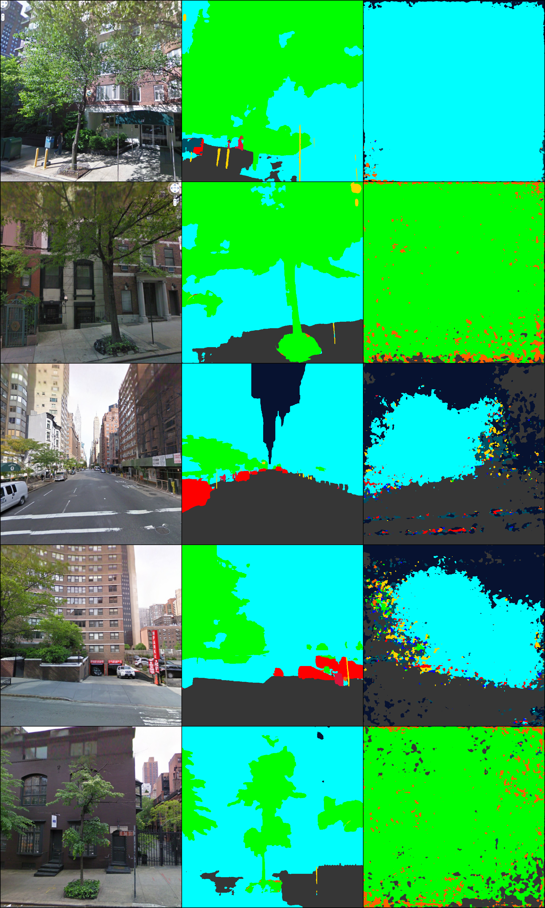
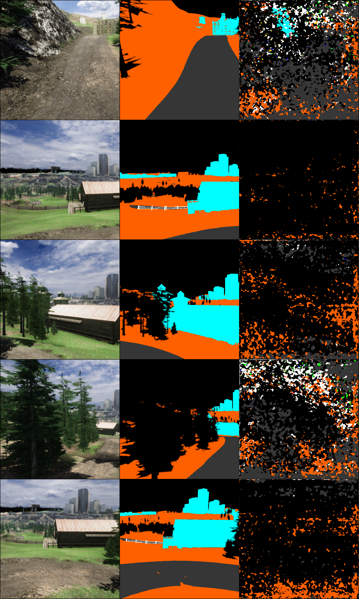

# Art
A random collection of creations, mistakes and borked experiments yielding visually surprising results

### GPU utilization

### Random Heartbeat

A cyclic GIF made of inferences through a GauGAN generator from noise. The central pixel in the noise input is scaled according to a cosine function.

### Pointillisme

Segmentation models in the begining of their training on real and simulated data

### House to Zebra

A new task for image to imag translation models. Actually a borked Masker.

### Psycho-floods

The painter's output when not pasting the original content back onto the mask

### Tribute to Jimi

Crazy hazing when forgetting to convert linear RGB to standard RGB. 

### Psychedelic collage
Something went wrong in linear RGB to RGB conversion when trying to smog the image

### Bridget Riley would be proud 
What happened to my depth map ?

### Wildfire logging failure

First attempt to log wildfires gave cool results.

